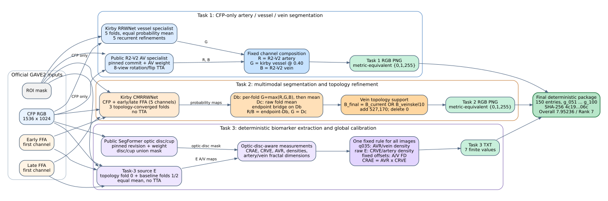

# Final artifact map

This directory is the short route to the exact 2026-07-31 21:34 KST
preliminary submission:

`kirby_finalpush_t1reproR2G040_t2currentR_DcG_veinskel10OR_t3bestfield_compact_metric_equivalent.zip`

The final ZIP contains 150 files (`g_051`–`g_100`) and is hash-pinned as
`4c19a97503668ef003c992edcbf76ade644c40903b683394347c0214db51306c`.

| Output | Final method | Guide |
|---|---|---|
| Task 1 | Public R2-V2 artery/vein + five-fold kirby vessel specialist | [`TASK1.md`](TASK1.md) |
| Task 2 | Three-fold topology ensemble, endpoint bridge, Dc/Db channel composition, additive vein support | [`TASK2.md`](TASK2.md) |
| Task 3 | Source-E biomarker extraction + fixed global calibration | [`TASK3.md`](TASK3.md) |
| Paper text | Dataset, split, augmentation, preprocessing, post-processing, and training strategy | [`PAPER_EXPERIMENT_CONFIGURATION.md`](PAPER_EXPERIMENT_CONFIGURATION.md) |
| Docker | Raw-input end-to-end reproduction and verification | [`DOCKER.md`](DOCKER.md) |

## Source map

| Purpose | Exact implementation |
|---|---|
| Local model training | [`train/train.py`](../train/train.py), [`train/official_loss.py`](../train/official_loss.py) |
| Local fold inference | [`get_predictions.py`](../get_predictions.py) |
| Equal fold ensemble | [`ensemble_predictions.py`](../ensemble_predictions.py) |
| Task 2 bridge / vein support | [`build_joint_exploration_submission.py`](../build_joint_exploration_submission.py), [`build_experimental_submission.py`](../build_experimental_submission.py) |
| Task 3 measurement | [`get_biomarker_kaggle.py`](../get_biomarker_kaggle.py), [`material_review/optic_disc_segformer.py`](../material_review/optic_disc_segformer.py) |
| Final composition, calibration, compact encoding, ZIP validation | [`material_review/pipeline.py`](../material_review/pipeline.py) |
| Raw-input Docker launcher | [`material_review/run_end_to_end_docker.sh`](../material_review/run_end_to_end_docker.sh) |

`material_review/weights_manifest.json` is the authoritative list of the
eleven local selected checkpoints and all external model hashes. It is more
reliable than filenames alone.
